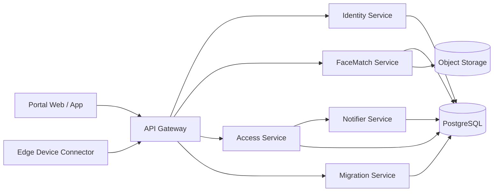

# Arquitectura lógica

```mermaid
flowchart LR
  WEB[Portal Web / App]
  EDGE[Edge Device Connector]
  GATEWAY[API Gateway]
  ID[Identity Service]
  FM[FaceMatch Service]
  AC[Access Service]
  MG[Migration Service]
  NO[Notifier Service]
  DB[(PostgreSQL)]
  OBJ[(Object Storage)]

  WEB --> GATEWAY
  EDGE --> GATEWAY
  GATEWAY --> ID
  GATEWAY --> FM
  GATEWAY --> AC
  GATEWAY --> MG
  AC --> NO
  ID --> DB
  FM --> DB
  AC --> DB
  MG --> DB
  NO --> DB
  FM --> OBJ
```
